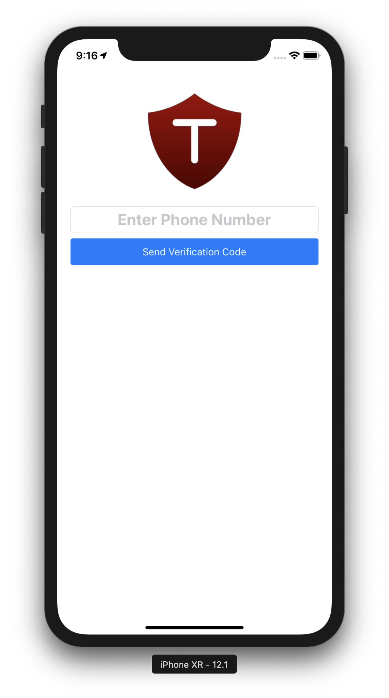

# TapGuard
1. Bodyguards are stoneage. Today we use TapGuard
2. Guardian app that notifies your loved ones on demand and automatically. 
3. When you are travelling, if you feel unsafe, you tap a button to notify your guardians/emergency contacts

- [TapGuard](#tapguard)
- [Cocoapods Used](#cocoapods-used)
- [Contribution Overview](#contribution-overview)
    - [Charles](#charles)
    - [Saksham](#saksham)
    - [Dhawal](#dhawal)
- [Mockup](#mockup)
- [Application Development Phase UI Screenshots](#application-development-phase-ui-screenshots)
    - [Login View](#login-view)
    - [Phone Verification View](#phone-verification-view)
    - [Code Verification View](#code-verification-view)
    - [Home View](#home-view)
    - [Settings View](#settings-view)
    - [Recent Locations View](#recent-locations-view)
    - [Journey View](#journey-view)

# Cocoapods Used
1. Firebase: Core, Auth, Phone, Database, GoogleSignIn
2. SwiftyButton
3. PhoneNumberKit
4. LocationPickerViewController
5. Alamofire

# Contribution Overview
## Charles
- UI Mockup with Adobe XD
- LoginViewController and LoginView
- PhoneNumberViewController and PhoneNumberView
- VerificationViewController and VerificationView
- HomeViewController and HomeView (With Saksham)
- JourneyViewController and JourneyView (With Saksham)
- Twilio and Firebase Setup
- EmergencyContact Model (With Saksham)
- Functions API which connects client side to Firebase

## Saksham
- HomeViewController and HomeView (With Charles)
- JourneyViewController and JourneyView (With Charles)
- RecentLocationsViewController and RecentLocationsView
- SettingsView UI Components
- User Model
- EmergencyContact Model (With Charles)

## Dhawal
- SettingsViewController and SettingsView (Still under development)

# Mockup
https://xd.adobe.com/view/4fcc0843-b4a6-4c78-7cff-e146b7e54226-39fd/

# Application Development Phase UI Screenshots
## Login View

## Phone Verification View

## Code Verification View

## Home View

## Settings View
Still under construction
<!-- 
 -->

## Recent Locations View

## Journey View

